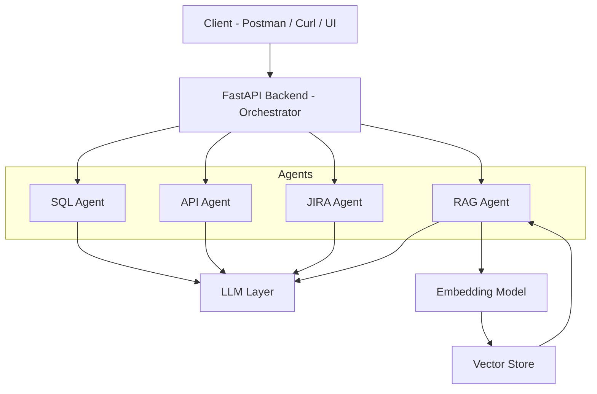

# 🚀 Agentic ChatGPT System (Production-Ready FastAPI Backend)

A scalable, production-ready **Agentic AI backend system** built with FastAPI, supporting:

* 🤖 Multi-agent orchestration (SQL, API, JIRA, RAG)
* 🧠 Real LLM integration (OpenAI / AWS Bedrock-ready)
* 📄 Retrieval-Augmented Generation (RAG) with embeddings
* ⚙️ Config-driven architecture using environment variables
* ⚡ Async, modular, and extensible backend

---

## 🧠 Architecture



---

## 📁 Project Structure

```bash
agentic-chatgpt-system/
│
├── backend/
│   ├── main.py
│   ├── config.py
│   ├── requirements.txt
│   │
│   ├── agents/
│   │   ├── orchestrator.py
│   │   ├── sql_agent.py
│   │   ├── api_agent.py
│   │   ├── jira_agent.py
│   │   └── rag_agent.py
│   │
│   ├── tools/
│   │   ├── db.py
│   │   ├── vector_store.py
│   │   └── embeddings.py
│   │
│   ├── models/
│   │   └── llm.py
│   │
│   ├── schemas/
│   │   └── chat.py
│   │
│   ├── utils/
│   │   └── logger.py
│   │
│   └── data/
│       ├── sample.db
│       └── docs/
│
├── ingest.py
├── postman/
│   └── agentic-chatgpt.postman_collection.json
├── .env
└── README.md
```

---

## ⚙️ Prerequisites

* Python 3.9+
* pip
* Virtual environment (recommended)
* OpenAI API key (or AWS Bedrock credentials)

---

## 🔐 Environment Configuration

Create a `.env` file in root:

```env
OPENAI_API_KEY=your_api_key_here
MODEL_NAME=gpt-4o-mini
```

---

## 🚀 Setup & Run

### 🔹 1. Clone Repository

```bash
git clone https://github.com/akhilmakol/agentic-chatgpt-system.git
cd agentic-chatgpt-system/backend
```

---

### 🔹 2. Create Virtual Environment

```bash
python -m venv venv
venv\Scripts\activate   # Windows
```

> If PowerShell blocks activation:

```bash
Set-ExecutionPolicy -Scope Process -ExecutionPolicy Bypass
venv\Scripts\activate
```

---

### 🔹 3. Install Dependencies

```bash
python -m pip install -r requirements.txt
```

---

### 🔹 4. Ingest Documents (RAG Setup)

```bash
python ingest.py
```

---

### 🔹 5. Run FastAPI Server

```bash
python -m uvicorn main:app --reload
```

---

## 🌐 API Access

* Base URL:
  http://127.0.0.1:8000

* Swagger UI:
  http://127.0.0.1:8000/docs

---

## 🧪 API Usage

### 🔹 POST `/chat`

#### Request:

```json
{
  "message": "Create JIRA story for login feature"
}
```

#### Response:

```json
{
  "response": "Generated output..."
}
```

---

## 📦 Postman Collection

```bash
postman/agentic-chatgpt.postman_collection.json
```

### 👉 How to Use

1. Open Postman
2. Click **Import**
3. Select the collection file

---

## 🧪 Sample Prompts

* "Create JIRA story for payment API"
* "Fetch SQL data from sales table"
* "Call API for bitcoin price"
* "Explain RAG architecture"

---

## 🧩 Agent Capabilities

### 🔹 SQL Agent

* Executes database queries
* Extendable to Text-to-SQL using LLM

---

### 🔹 API Agent

* Calls external APIs
* Easily configurable

---

### 🔹 JIRA Agent

Generates structured user stories:

* Title
* Description
* Acceptance Criteria
* Story Points

---

### 🔹 RAG Agent

* Retrieves relevant context
* Uses embeddings + vector similarity

---

## 📄 RAG Workflow

1. Add documents to:

```bash
backend/data/docs/
```

2. Run ingestion:

```bash
python ingest.py
```

3. Query via `/chat`

---

## 🔧 LLM Integration

Update:

```bash
backend/models/llm.py
```

Supported:

* OpenAI (default)
* AWS Bedrock
* Hugging Face
* Local models

---

## 🧾 Logging

Basic logging included:

```bash
backend/utils/logger.py
```

---

## 🐳 Docker (Optional)

```bash
docker-compose up --build
```

---

## 🚀 Future Enhancements

* 🔄 Streaming responses (token-level)
* 🧠 Memory (chat history)
* 🔐 Authentication (JWT / OAuth)
* 📊 Monitoring (Prometheus, Grafana)
* ☁️ AWS deployment (ECS / Lambda / Bedrock)
* 🧩 LangGraph multi-agent workflows
* 🗄️ PostgreSQL + pgvector

---

## 🧠 Tech Stack

* Backend: FastAPI
* LLM: OpenAI / Bedrock (pluggable)
* Embeddings: Sentence Transformers
* Vector DB: FAISS
* Agents: Custom orchestration

---

## 🤝 Contributing

Pull requests are welcome!

---

## 📜 License

MIT License

---

## 👨‍💻 Author

Built by Akhil Makol
AI | Data | Agentic Systems

---

## ⭐ Support

If you find this useful:

* ⭐ Star the repo
* 🔁 Share with your network
* 💡 Contribute ideas
